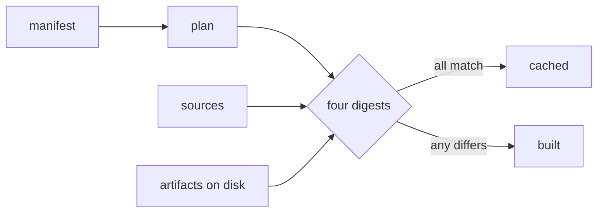

# ProCMP

A minified release, a readable debug build, a Roblox variant and a Lune variant, all described in one file and built by one command.

[darklua](https://darklua.com) is linked in as a library, so `pcmp` is a single binary with nothing to install beside it.

!!! success "A build stamp costs you nothing"

    Put the version and the time in your header. `pcmp build --lock` writes down what the build read, and `pcmp build --frozen` reproduces it exactly, timestamp included.

## What a profile changes

```lua title="src/init.luau" hl_lines="2 4"
--!strict
local VERSION: string = PCMP_VERSION

if DEBUG then
	print("verbose telemetry")
end

return VERSION
```

One source file, one manifest, two profiles.

=== "release"

    ```lua title="dist/release/app.luau"
    -- app v1.0.0
    local a='v1.0.0'return a
    ```

    `DEBUG` folds to `false`, and the branch leaves the artifact instead of shipping as `if false then`.

=== "dev"

    ```lua title="dist/dev/app.luau"
    local VERSION: string = 'v1.0.0'

    if true then
        print('verbose telemetry')
    end

    return VERSION
    ```

    Nothing was stripped, so a stack trace still points at the line you wrote.

## How a build is decided

Four digests, and a task is skipped only when all four match what the last build recorded.



`plan` covers the resolved task, `shape` covers which files exist, `reads` covers what darklua opened, and `artifacts` covers what is on disk. The fourth is what notices an artifact edited by hand, which an inputs-only stamp never could.

## Where to go

<div class="grid cards" markdown>

-   :lucide-download:{ .lg .middle } __Install__

    ---

    One binary from rokit, aftman or cargo, and editor completion for the manifest.

    [:octicons-arrow-right-24: Install](install.md)

-   :lucide-rocket:{ .lg .middle } __Your first build__

    ---

    From an empty project to two artifacts and a cache that holds.

    [:octicons-arrow-right-24: Your first build](first-build.md)

-   :lucide-file-cog:{ .lg .middle } __Manifest__

    ---

    Every field, what it does, and the five formats it can be written in.

    [:octicons-arrow-right-24: Manifest](manifest.md)

-   :lucide-circle-alert:{ .lg .middle } __Diagnostics__

    ---

    Every code `pcmp` can report, generated from the binary itself.

    [:octicons-arrow-right-24: Diagnostics](diagnostics.md)

</div>
